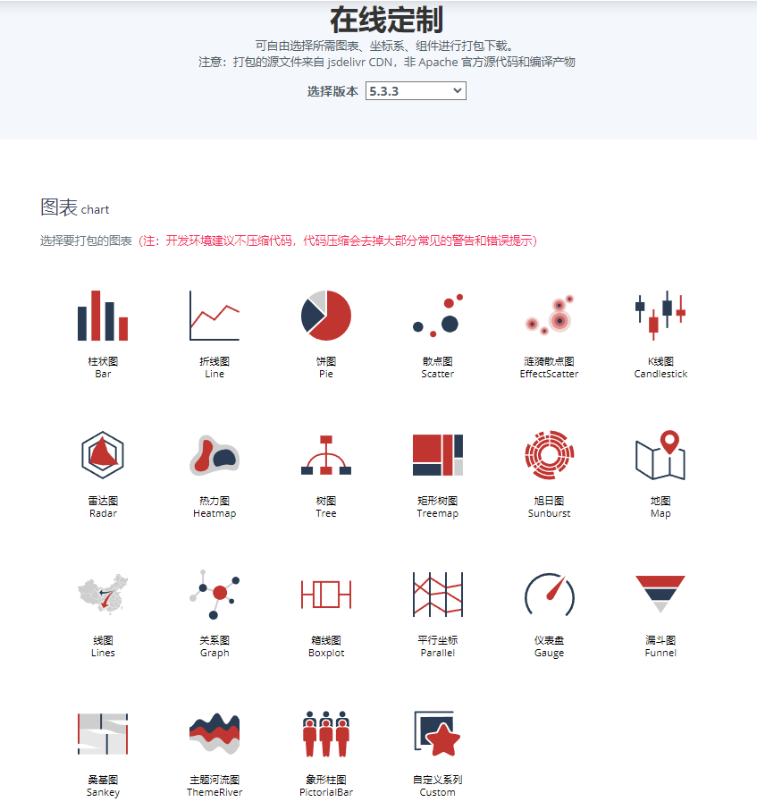

  <h1>eCharts</h1>
  
通过Qt的QWebView使用eCharts提供数据可视化图表

  

<h2>eCharts介绍</h2>

	<a href="echarts.apache.org">官网地址</a>
  	

	
这里有下载好的： <a href="./Doc/eCharts图表">传送门</a>

<h2>如何引入到Qt项目中</h2>

<bold>引入webview模块</bold>

如果你使用的是qmake

	<pre><code>
  QT += webenginewidgets
  </code></pre>
  
如果你使用的是cmake

	<pre><code>
  find_package(Webenginewidgets)
  </code></pre>

